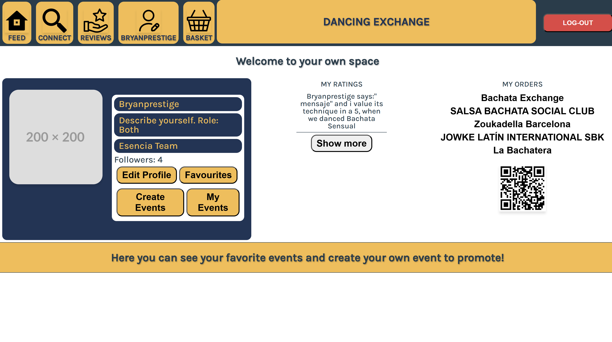
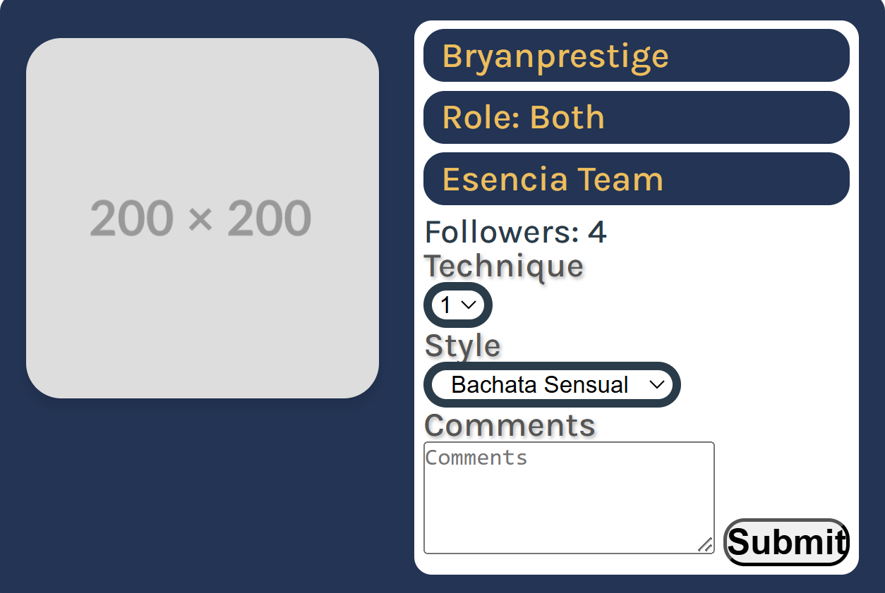
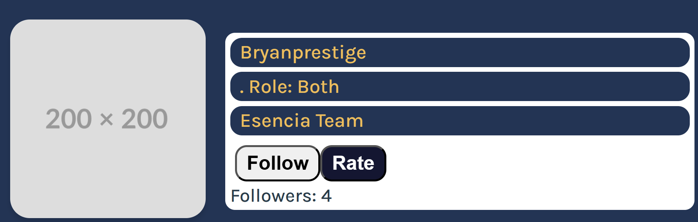
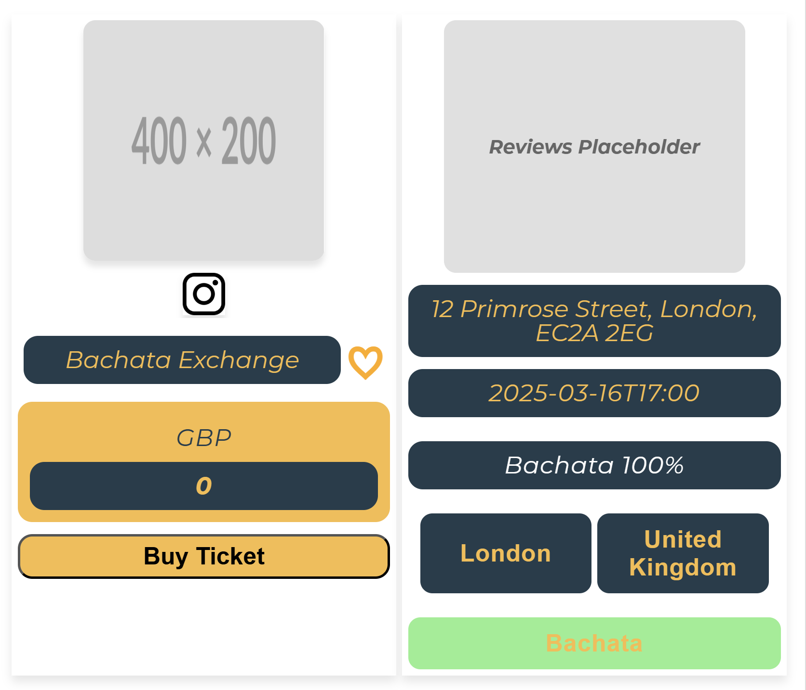
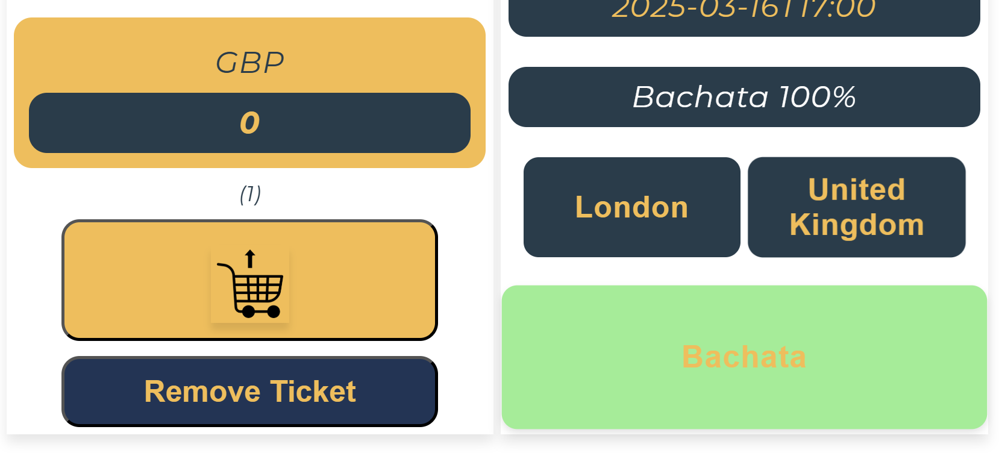
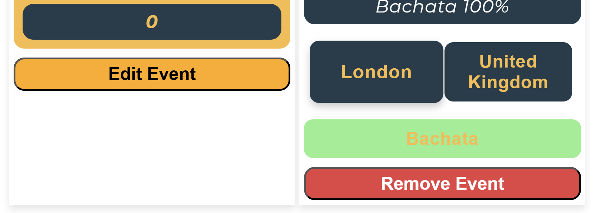
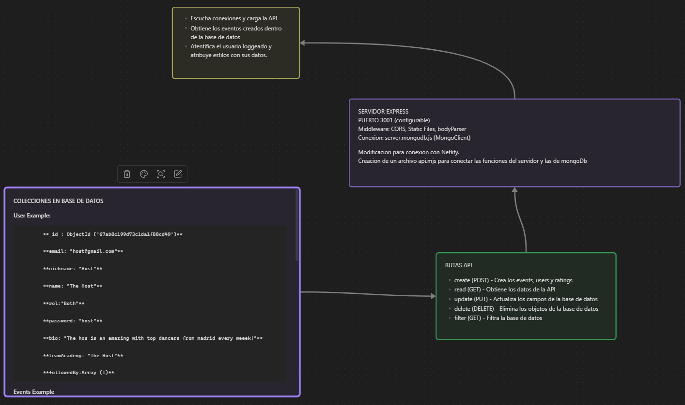

# DANCING EXCHANGE

[](https://app.netlify.com/sites/dancingexchange/deploys)

Dancing exchange es un servicio que permite a los usuarios tener un perfil y crear eventos a compartir con el mundo. Estos eventos podran ser comprados online y acceder al ticket dentro del mismo perfil de usuario.

## DESCRIPCION DEL LA PLATAFORMA

La aplicación consiste en una página de muestra de eventos de baile social, donde los usuarios pueden registrarse y utilizar sus credenciales para acceder a la página web y desbloquear la opción de crear eventos, editarlos y guardarlos en favoritos para verlos en su perfil.

También pueden seguirse entre sí y en un futuro, enviarse mensajes. Tienen la opción de valorar a otros usuarios y promotores de eventos dependiendo de su experiencia con ellos y así hacer un ranking de quién es un buen bailarín y qué eventos son buenos.
Hacer las valoraciones de usuarios y el ranking publicos estan en fase de desarrollo.

### SNIPPETS DE LA PLATAFORMA

Perfil de usuario en el cual tiene las siguientes funcionalidades:

1. Editar los datos del usuario (el nickname, la bio y a que academia o team     pertenecen)

2. Mostrar todos los eventos que hayan sido marcados previamente como favoritos

3. Crear eventos para compartir y poder vender tickets.

4. Mostrar los eventos que hayan sido creados previamente por el usuario.

5. Mostrar mas valoraciones que se hayan hecho al usuario

6. Mostrar el QR code al ticket del evento



La tarjeta del perfil dentro de las reviews tiene las siguientes funcionalidades:

1. Hacer follow al usuario deseado

2. Dirigirte a la seccion de reviews con el usuario seleccionado



La tarjeta de perfil dentro del CONNECT tiene las siguientes funcionalidades:



Evento en el feed tiene las siguientes funcionalidades:

1. Muestra los datos del eventos

2. Link hacia la red social del evento

3. Boton al evento seleccionado para comprar

4. Botones para filtrar los eventos por el campo seleccionado



Evento en el basket tiene las siguientes funcionalides:

1. Comprar un ticket un evento

2. Eliminar un ticket del evento


Evento en  My Events tiene las siguientes funcionalides:

1. Editar los datos del evento

2. Eliminar un evento



## Tecnologías Utilizadas

### FrontEnd

.HTML

.CSS (Responsive)

.JavaScript

.Lit Components

### Backend

.Node.js

.Express

.MongoDB( Base de datos)

Autenticación: Server Express

Herramientas adicionales: ESLint, .env, body-parser, CORS

## Tecnologías Aplicadas durante el desarrollo de la aplicacion 

REDUX

Static server y API server

Servidor CRUD

Base de datos local en JSON

## Docs y buena praxis

JSDoc para la documentación del código

GitHub para gestión de repositorios

Git Hooks y Linters para comprobación de errores:

ESLint

StyleLint

Lint-Staged

commitlint

Conventional Commits para mensajes de commits estandarizados

## Estructura del Proyecto

```plaintext
📁 Proyect/
│── 📂 server/              # Servidor principal
│   │── server-api.js        # API (No en uso)
│   │── server-express.js    # Servidor principal Express
│   │── server-mongodb.js    # Conexión y operaciones en MongoDB
│   │── server-oauth.js      # Simulacion authentication
│── 📂 src/                 # Código fuente del frontend
│── 📄 .env                 # Variables de entorno
│── 📄 package.json         # Configuración del proyecto y dependencias
│── 📄 README.md            # Documentación
```

## Instalación y Configuración

### 1️ Clonar el Repositorio

[git clone](https://github.com/bryanprestige/NEOLAND-BOOTCAMP-BRYAN-.git)
`cd Proyecto`

### 2️ Instalar Dependencias

`npm install`

### 3️ Ejecuta el servidor backend

Crea un archivo .env en la raíz del proyecto y agrega lo siguiente:
`MONGO_URI=mongodb://127.0.0.1:27017/`
`PORT=1337`

npm run server:express:start

### 4️ Accede al frontend de la aplicación

`npm start`
O manualmente:
`node server/server-express.js`

## Configuracion de puertos

configuración de puertos se define en el archivo .env, no incluido en el repositorio de Git.

## Dependencias de la aplicacion

Node >= 20.0.0

Express

MongoDB (visualizacion de la base de datos en Compass y Atlas como servicio en la cloud)

JSDoc (Documentacion de los metodos)

Typescript (Escribir un codigo seguro y profesional)

Jest (Testeo)

ESLint

Lint-Staged

StyleLint

Netlify (despliegue del FronEnd)

## Plugins de VS recomendados

GitHub Pull Requests

Live Preview

Live Server

Error Lens

Markdownlint

lit-html

CORS

Postman

## Modelo de datos y relación entre componentes

Dancing Exchange utiliza un modelo de datos basado en MongoDB, con colecciones para eventos, usuarios y valoraciones. La relación entre componentes se establece mediante la utilización de IDs y referencias entre documentos.



### Pre-commit y pre-push

La aplicación utiliza lint-staged para ejecutar validaciones antes de ejecutar el commit, y Jest para ejecutar pruebas unitarias antes de ejecutar el push.

### 📜 Scripts Disponibles

Desde el archivo package.json, puedes ejecutar los siguientes comandos:

### Comando

### Descripción

npm start

Inicia el servidor principal con Express

npm run server:express:start

Inicia el servidor con variables de entorno

npm run server:statics:start

Inicia el servidor de archivos estáticos

npm run server:api:start

Inicia solo el servidor de la API

npm run lint

Ejecuta ESLint para validar código

## Endpoints de la API

## USERS

| Método  | USER                  | Descripción             |
|---------|------------------------|-------------------------|
| POST    | `/create/user`        | Crea un nuevo usuario   |
| GET     | `/read/users`          | Obtiene todos los usuarios |
| PUT     | `/update/users/:id`    | Actualiza un usuario    |
| PUT     | `/followedBy/users/:id`    | Actualiza el campo followedBy del usuario o le hace push si no existe    |
| DELETE  | `/delete/user/:id`    | Elimina un usuario      |
| GET     | `/filter/users/:nickname`    | Filtra el usuario por el nicknmae    |
| GET     | `/filter/users/:id`    | Filtra el usuario por el id     |

## EVENTS

| Método  | EVENTS                     | Descripción                |
|---------|---------------------------|----------------------------|
| POST    | `/create/event`       | Crea un nuevo evento     |
| GET     | `/read/events`         | Obtiene todos los eventos |
| PUT     | `/updateBought/events/:id`      | Actualiza el campo updateBought de un evento o le hace push si no existe |
| PUT     | `/update/events/:id`   | Actualiza un evento      |
| DELETE  | `/delete/event/:id`   | Elimina un evento        |
| FILTER  | `/filter/events/:name` | Filtra un evento por el campo :name, danceType,venue,city, country, price |

## RATINGS

| Método  | RATINGS                     | Descripción                |
|---------|---------------------------|----------------------------|
| POST    | `/create/rating`       | Crea un nuevo rating     |
| GET     | `/read/ratings`         | Obtiene todos los ratings |
| PUT     | `/update/ratings/:id`   | Actualiza un evento      |
| DELETE  | `/delete/rating/:id`   | Elimina un evento        |
| FILTER  | `/filter/rating/:userRatedId` | Filtra un rating por el campo userratedid |

## Netlify

Inicia sesión en Netlify

Crea una nueva aplicación

Configura MongoDB como servicio

Despliega la aplicación

### Render (Para backend y frontend)

Crea una cuenta en Render

Conéctalo a tu repositorio de GitHub

Configura las variables de entorno (MONGO_URI, PORT=1337)

Ejecuta npm start para iniciar la aplicación
